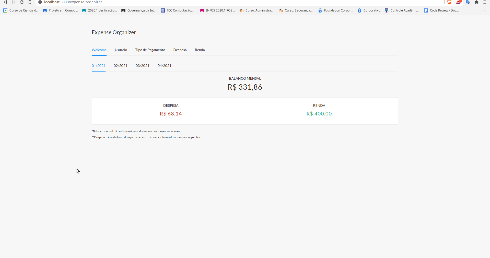

# Guia para utilização do expense-organizer

Simples aplicação web necessária para fazer a prova de conceito do TCC. Foi usada na demonstração da ferramenta [cytestion](https://github.com/mourats/cytestion). 

## Dependências

##### É necessário ter o [Node.js](https://nodejs.org/en/) e [Yarn](https://yarnpkg.com/) instalados.
##### É recomendado ter o [Docker](https://docs.docker.com/) e [Docker Compose](https://docs.docker.com/compose/install/) instalados.

## Execução

A aplicação possui um diretório contendo o frontend e outro contendo o backend, chamados de `web` e `api`, respectivamente.

O backend está configurado para se conectar com um banco [MySQL](https://www.mysql.com/), foi recomendado o uso do docker pois para simplificar foi configurado um arquivo `docker-compose.yml` que permite a instalação do banco MySQL em um container docker. Bastar executar na raiz do projeto o comando:

```
docker-compose up -d
```

Para executar a aplicação, é necessário instalar as dependências do contidas no `api` e `web`. E logo em seguida já possível inicializar eles.
##### Backend

Instalar as dependências e inicializar, assim:
```
cd api
yarn
yarn start
```

##### Frontend

Instalar as dependências e inicializar, assim:
```
cd web
yarn
yarn start
```

## Detalhes

Essa aplicação consiste em um simples gerenciador de gastos, onde é possível cadastrar usuários, tipos de pagamentos, despesas e rendas. Além de exibir a situação financeira, por mês, na página inicial. Ela foi construída utilizando [React](https://pt-br.reactjs.org/), [Ant Design](https://ant.design/) e [Mobx](https://mobx.js.org/README.html) no frontend e no backend, [Node.js](https://nodejs.org/en/) e [Sequelize](https://sequelize.org/). 

##### Para ter uma ideia do visual da aplicação, veja o gif:

